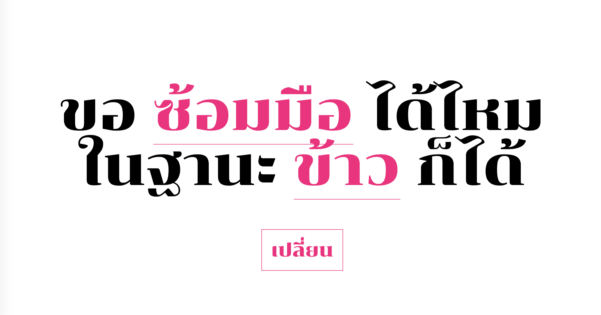

# ขอ … ได้ไหม ในฐานะ … ก็ได้
Automatic generation of a popular Thai wordplay joke "May I ... you, even as a ...?" Something like "May I *hug* you, even as a *bear*?"

## Idea
This sentence structure is funny (in Thai) when the combination of the two words gives a different meaning (*bearhug*, for example). Or, the first word can be used in various contexts and the second word suggests an unusual or unexpected usage so the sentence becomes funny. This demo deals with the first scenario only.

## Steps
All Thai compound words from Wiktionary (1,753 words) are split into two parts with Wordcut library. Then, find the part of speech of each part in Lexitron dictionary. If the first part is a noun and the second part is a verb, the word can be used in this kind of joke.

## Results

It is preliminary and not quite funny but interesting nonetheless.

